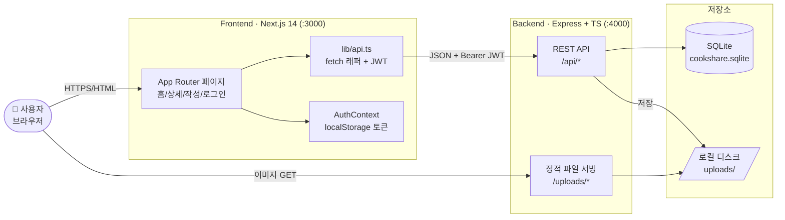
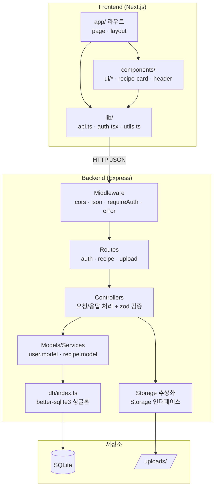
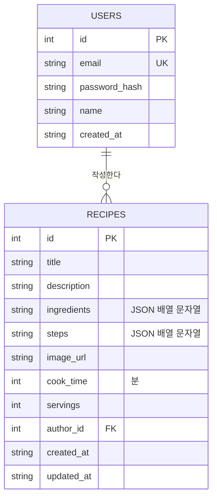
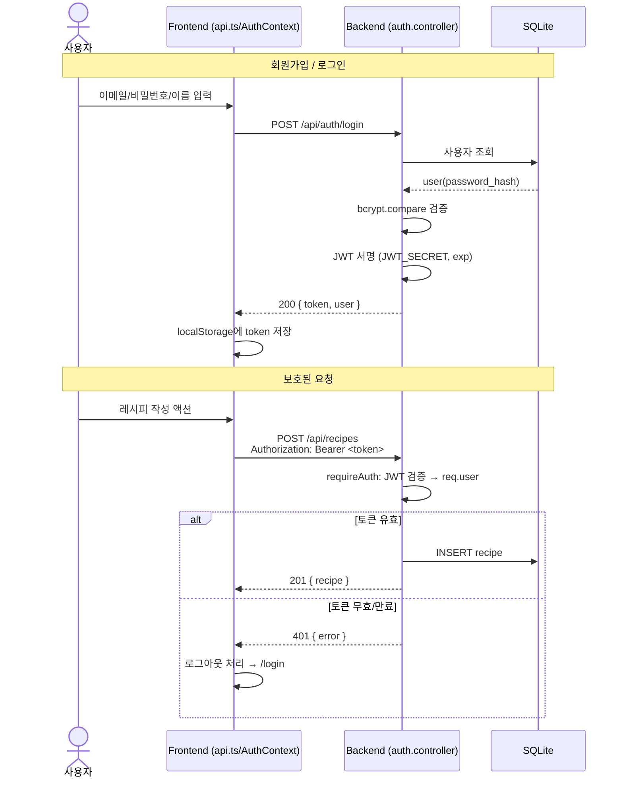
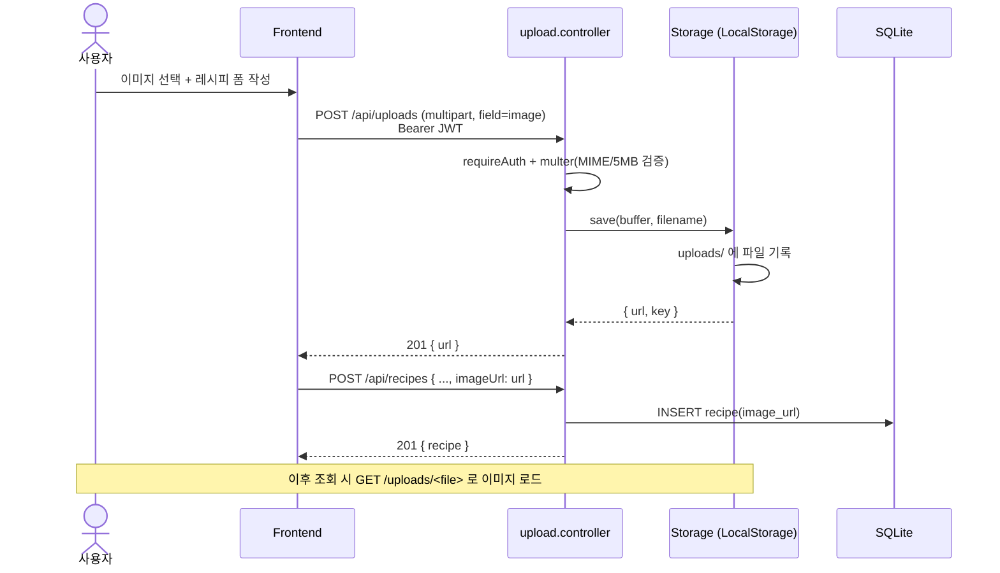
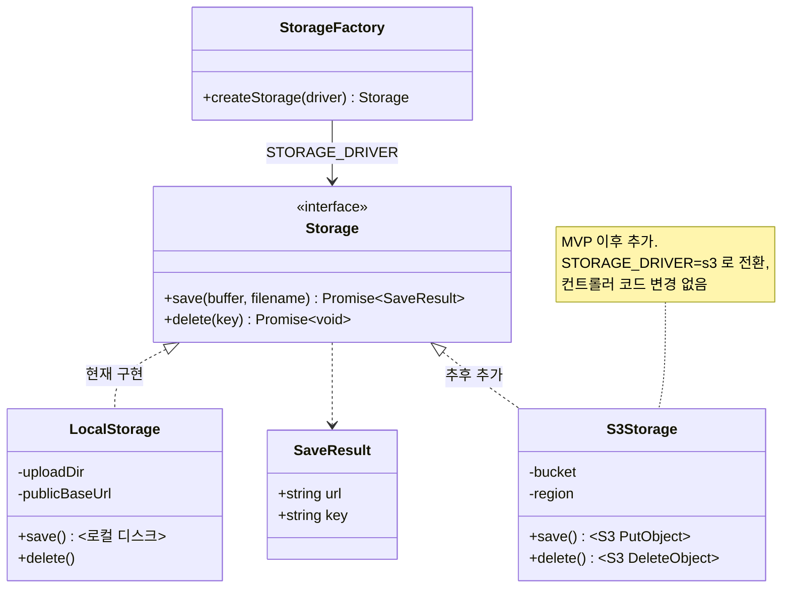
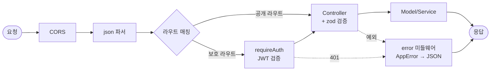
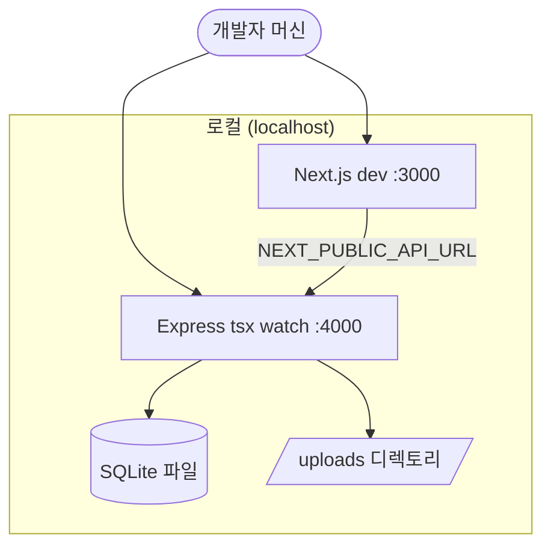
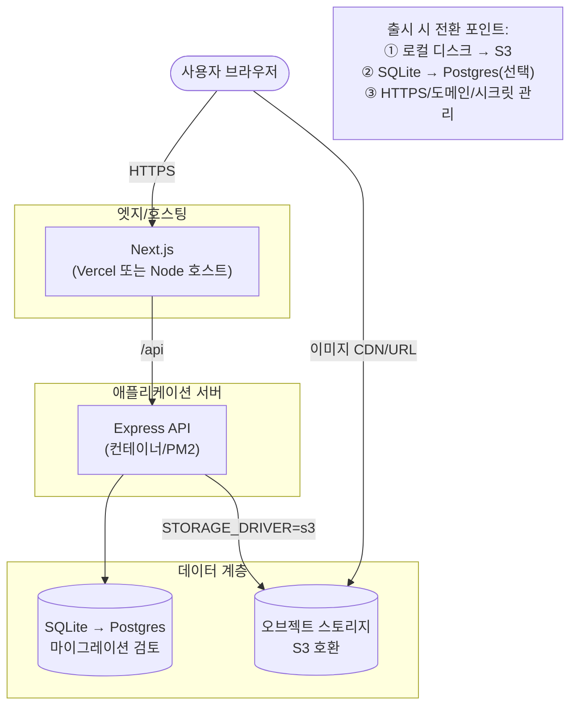

# CookShare 아키텍처

레시피 공유 서비스의 시스템 아키텍처 문서입니다. 실제 스캐폴딩된 코드 구조를 기준으로 작성되었습니다.

- 대상 스택: Next.js 14 (App Router) / Express + TS / SQLite / JWT / 로컬 이미지 저장
- 문서 버전: 2026-06-17

---

## 1. 시스템 컨텍스트 (High-Level)

사용자, 프론트엔드, 백엔드, 저장소 간의 큰 그림입니다.

---

## 2. 컴포넌트 아키텍처 (계층 구조)

백엔드의 요청 처리 계층과 프론트엔드의 모듈 구조입니다.

---

## 3. 데이터 모델 (ERD)

> `ingredients`/`steps`는 DB에 JSON 문자열로 저장하고, API 응답에서는 배열로 직렬화/역직렬화합니다.
> MVP 이후 확장 시 `likes`, `comments`, `tags`, `categories` 테이블이 추가될 수 있습니다(점선 영역).

---

## 4. 인증 흐름 (Sequence)

회원가입/로그인으로 JWT를 발급받고, 보호된 요청에 Bearer 토큰을 사용하는 흐름입니다.

---

## 5. 이미지 업로드 흐름 (Sequence)

레시피 작성 시 이미지를 먼저 업로드해 URL을 받고, 그 URL을 레시피에 연결합니다.

---

## 6. 스토리지 추상화 (로컬 → S3 전환 여지)

`Storage` 인터페이스로 저장 구현을 추상화하여, 환경 변수만으로 드라이버를 교체할 수 있습니다.

전환 절차:

1. `src/storage/s3.storage.ts`에 `S3Storage` 구현 추가
2. `src/storage/index.ts` 팩토리에 `s3` 분기 추가
3. 환경 변수 `STORAGE_DRIVER=s3` + S3 자격증명 설정
4. 컨트롤러/라우트는 `Storage` 인터페이스에만 의존하므로 변경 불필요

---

## 7. 요청 처리 파이프라인 (미들웨어 체인)

---

## 8. 배포 토폴로지

### 8.1 개발 환경 (현재)

### 8.2 목표 운영 환경 (MVP 출시 지향)

> 운영 환경 전환은 WBS의 8.4(배포 구성), 8.5(S3 스파이크)에서 다룹니다.
> 스토리지/DB가 인터페이스·설정으로 분리되어 있어 코드 변경 최소화가 목표입니다.

---

## 9. 기술 결정 요약 (ADR 축약)

| 결정                     | 선택                    | 이유                                        | 대안/전환                        |
| ------------------------ | ----------------------- | ------------------------------------------- | -------------------------------- |
| 프론트 프레임워크        | Next.js 14 App Router   | SSR/라우팅/DX, shadcn 생태계                | -                                |
| 백엔드                   | Express + TS            | 가볍고 친숙, 빠른 MVP                       | NestJS(규모 커지면)              |
| DB                       | SQLite (better-sqlite3) | 개발 단순성, 무설정, 동기 API               | Postgres(운영/동시성)            |
| 인증                     | JWT (Bearer)            | 무상태, FE/BE 분리에 적합                   | 세션+쿠키(보안 강화 시)          |
| 이미지 저장              | 로컬 디스크 + 추상화    | MVP 단순, Storage 인터페이스로 S3 여지 확보 | S3(STORAGE_DRIVER로 전환)        |
| 데이터 직렬화(재료/단계) | JSON 문자열 컬럼        | 스키마 단순, MVP 충분                       | 정규화 테이블(검색/통계 필요 시) |
