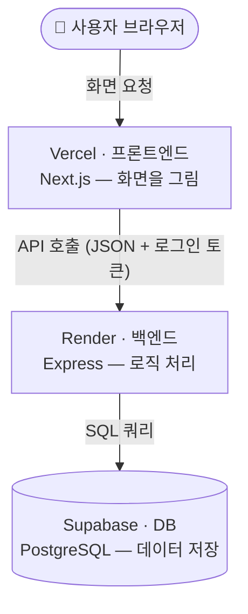
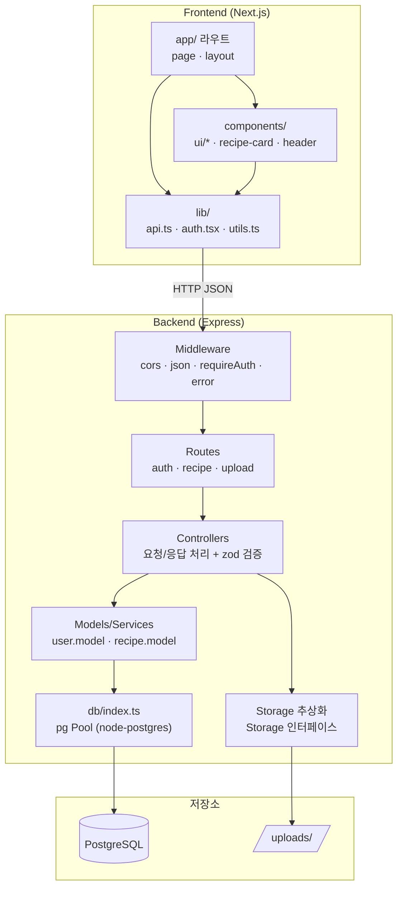
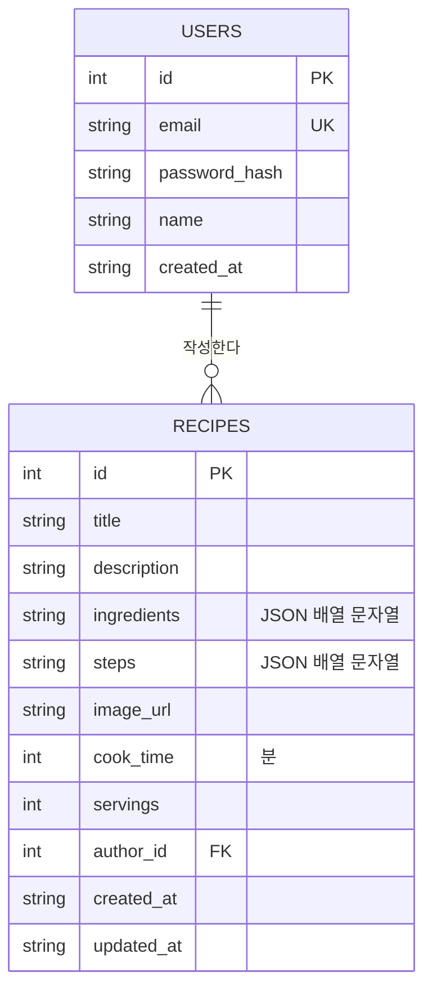
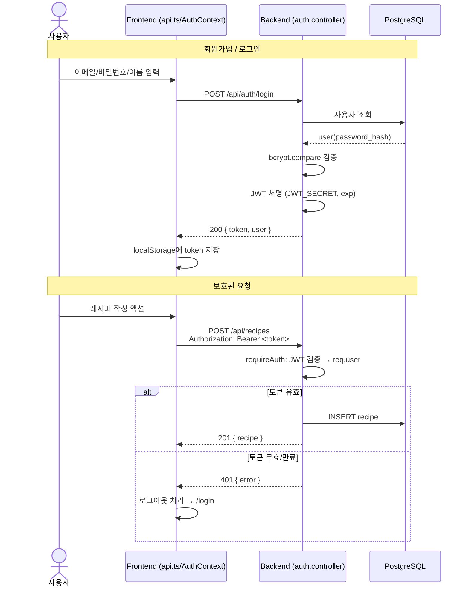
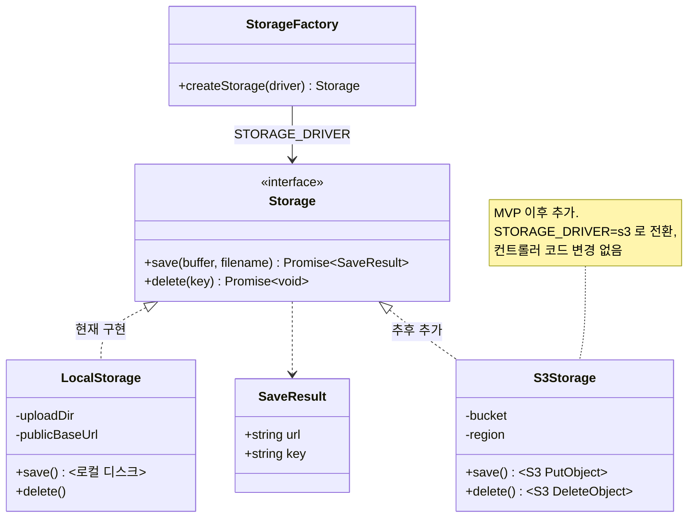
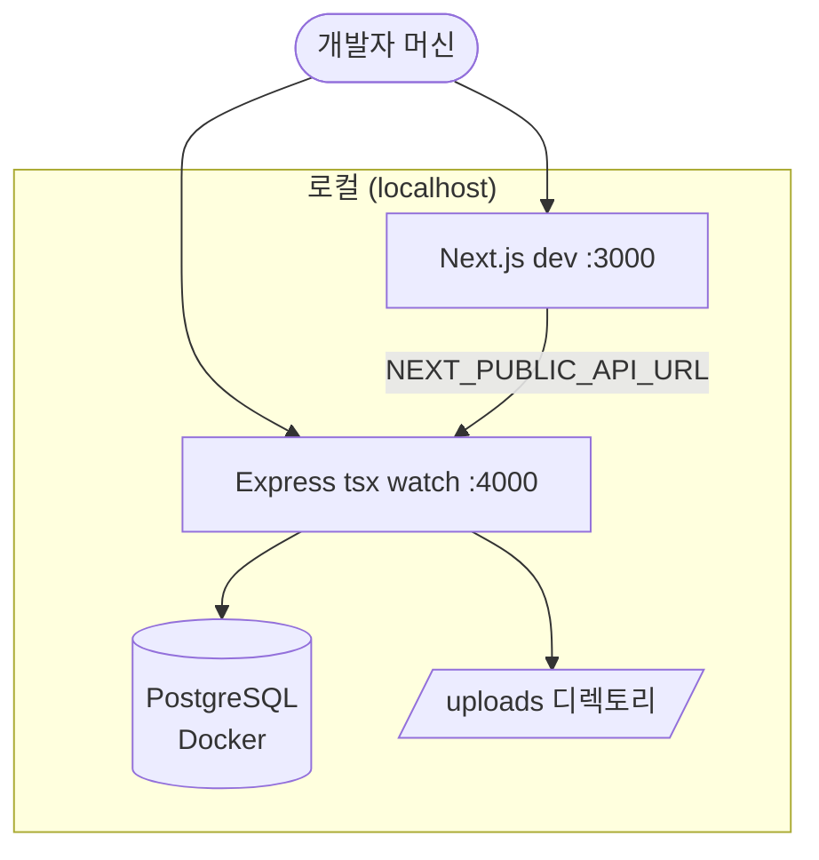
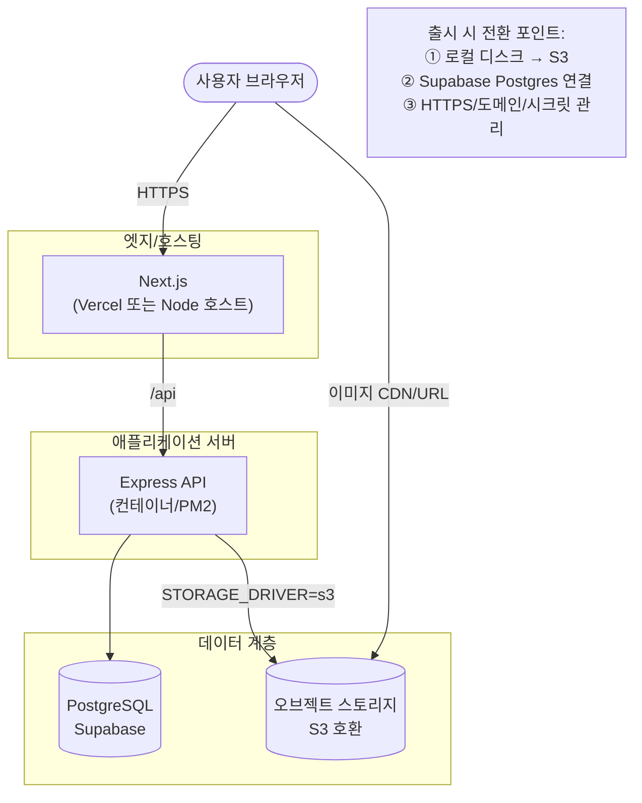
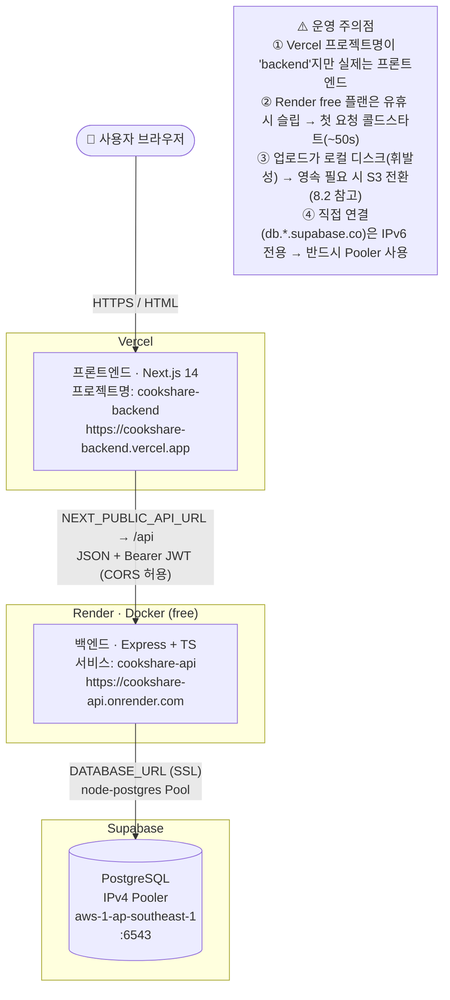
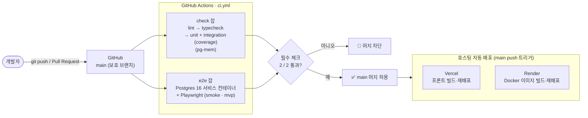
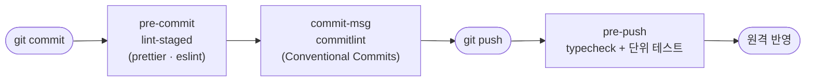

# CookShare 아키텍처

레시피 공유 서비스의 시스템 아키텍처 문서입니다. 실제 스캐폴딩된 코드 구조를 기준으로 작성되었습니다.

- 대상 스택: Next.js 14 (App Router) / Express + TS / PostgreSQL / JWT / 로컬 이미지 저장
- 문서 버전: 2026-06-18 (실제 배포 구성 · CI/CD 다이어그램 반영)

---

## 0. 한눈에 보기 (쉬운 설명)

이 서비스는 **사용자 → Vercel(화면) → Render(API) → Supabase(데이터)** 로 흐르는, 세 덩어리로 나뉜 웹앱입니다.

**각 덩어리가 하는 일**

| 덩어리     | 위치     | 역할                                    | 비유           |
| ---------- | -------- | --------------------------------------- | -------------- |
| 프론트엔드 | Vercel   | 사용자가 보는 화면 (목록·작성폼·로그인) | 식당 홀/메뉴판 |
| 백엔드     | Render   | 규칙 처리 (인증, 레시피 CRUD)           | 주방           |
| DB         | Supabase | 데이터 영구 저장 (회원, 레시피)         | 창고           |

**작동 흐름 (예: 레시피 작성)**

1. 사용자가 Vercel 화면에서 폼 작성 → 등록 클릭
2. 프론트가 Render 백엔드로 "이 레시피 저장해줘" + 로그인 토큰 전송
3. 백엔드가 토큰 확인(본인 맞나?) 후 Supabase에 저장
4. 결과를 화면에 표시

**기억할 포인트 3개**

- **세 곳이 분리**되어 각각 독립적으로 배포·확장 가능 (프론트만 고쳐도 백엔드 영향 없음)
- **연결 고리는 환경변수**: 프론트의 `NEXT_PUBLIC_API_URL`(→Render) + 백엔드의 `CORS_ORIGIN`(→Vercel 허용) + `DATABASE_URL`(→Supabase). 이게 어긋나면 "Failed to fetch"가 발생
- **인증은 토큰(JWT)**: 로그인 시 토큰을 발급받아 브라우저에 보관하고, 요청마다 함께 보내 신원을 증명

> 아래 1장부터는 위 그림을 계층·시퀀스·배포 관점으로 더 자세히 풀어 설명합니다.

---

## 1. 시스템 컨텍스트 (High-Level)

사용자, 프론트엔드, 백엔드, 저장소 간의 큰 그림입니다.

---

## 2. 컴포넌트 아키텍처 (계층 구조)

백엔드의 요청 처리 계층과 프론트엔드의 모듈 구조입니다.

---

## 3. 데이터 모델 (ERD)

> `ingredients`/`steps`는 DB에 JSON 문자열로 저장하고, API 응답에서는 배열로 직렬화/역직렬화합니다.
> MVP 이후 확장 시 `likes`, `comments`, `tags`, `categories` 테이블이 추가될 수 있습니다(점선 영역).

---

## 4. 인증 흐름 (Sequence)

회원가입/로그인으로 JWT를 발급받고, 보호된 요청에 Bearer 토큰을 사용하는 흐름입니다.

---

## 5. 이미지 업로드 흐름 (Sequence)

레시피 작성 시 이미지를 먼저 업로드해 URL을 받고, 그 URL을 레시피에 연결합니다.

---

## 6. 스토리지 추상화 (로컬 → S3 전환 여지)

`Storage` 인터페이스로 저장 구현을 추상화하여, 환경 변수만으로 드라이버를 교체할 수 있습니다.

전환 절차:

1. `src/storage/s3.storage.ts`에 `S3Storage` 구현 추가
2. `src/storage/index.ts` 팩토리에 `s3` 분기 추가
3. 환경 변수 `STORAGE_DRIVER=s3` + S3 자격증명 설정
4. 컨트롤러/라우트는 `Storage` 인터페이스에만 의존하므로 변경 불필요

---

## 7. 요청 처리 파이프라인 (미들웨어 체인)

---

## 8. 배포 토폴로지

### 8.1 개발 환경 (현재)

### 8.2 목표 운영 환경 (MVP 출시 지향)

> 운영 환경 전환은 WBS의 8.4(배포 구성), 8.5(S3 스파이크)에서 다룹니다.
> 스토리지/DB가 인터페이스·설정으로 분리되어 있어 코드 변경 최소화가 목표입니다.

---

### 8.3 현재 운영 배포 (실제 구성, 2026-06-18)

실제로 배포되어 동작 중인 토폴로지입니다. (8.2 는 지향 목표, 본 절은 현재 상태)

핵심 환경 변수 매핑:

| 위치            | 변수                  | 값                                                                                |
| --------------- | --------------------- | --------------------------------------------------------------------------------- |
| Vercel (프론트) | `NEXT_PUBLIC_API_URL` | `https://cookshare-api.onrender.com/api` (빌드 시 주입 → 변경 시 **재배포 필수**) |
| Render (백엔드) | `DATABASE_URL`        | Supabase **pooler** 연결 문자열 (host `...pooler.supabase.com`)                   |
| Render (백엔드) | `DATABASE_SSL`        | `true`                                                                            |
| Render (백엔드) | `CORS_ORIGIN`         | `https://cookshare-backend.vercel.app` (끝 슬래시 없음)                           |
| Render (백엔드) | `JWT_SECRET`          | 자동 생성                                                                         |

> 배포 대안: Railway(`railway.json`), Kubernetes(`k8s/`) 매니페스트도 저장소에 준비되어 있습니다.

---

## 9. CI/CD 파이프라인

GitHub Actions(`.github/workflows/ci.yml`)와 `main` 브랜치 보호 규칙, 호스팅 자동 배포의 흐름입니다.

로컬 게이트(개발자 머신, Husky):

---

## 10. 기술 결정 요약 (ADR 축약)

| 결정                     | 선택                       | 이유                                        | 대안/전환                        |
| ------------------------ | -------------------------- | ------------------------------------------- | -------------------------------- |
| 프론트 프레임워크        | Next.js 14 App Router      | SSR/라우팅/DX, shadcn 생태계                | -                                |
| 백엔드                   | Express + TS               | 가볍고 친숙, 빠른 MVP                       | NestJS(규모 커지면)              |
| DB                       | PostgreSQL (node-postgres) | 운영/동시성, Supabase 호환, 무상태 백엔드   | 개발: Docker · 테스트: pg-mem    |
| 인증                     | JWT (Bearer)               | 무상태, FE/BE 분리에 적합                   | 세션+쿠키(보안 강화 시)          |
| 이미지 저장              | 로컬 디스크 + 추상화       | MVP 단순, Storage 인터페이스로 S3 여지 확보 | S3(STORAGE_DRIVER로 전환)        |
| 데이터 직렬화(재료/단계) | JSON 문자열 컬럼           | 스키마 단순, MVP 충분                       | 정규화 테이블(검색/통계 필요 시) |
