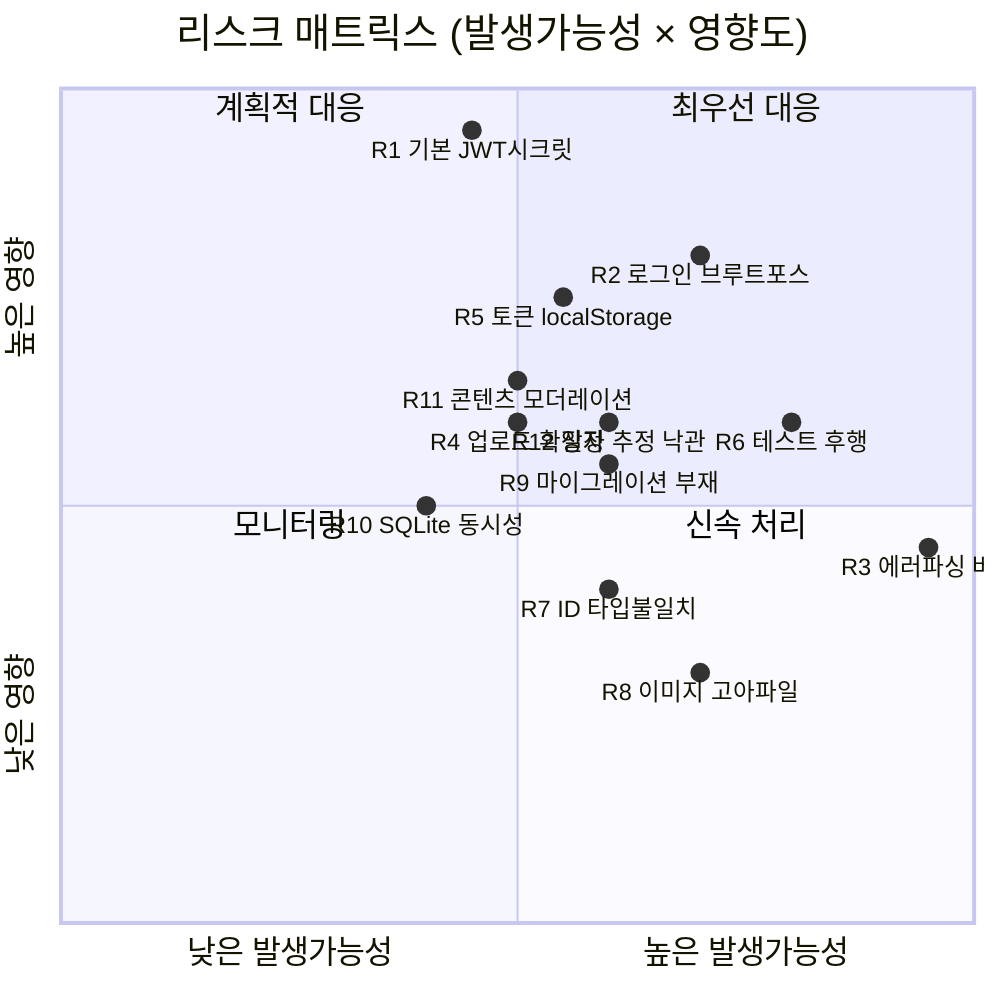

# CookShare 리스크 분석

설계 산출물(`MVP-SPEC.md`, `WBS.md`, `ARCHITECTURE.md`)과 **실제 스캐폴딩된 코드**를 함께 검토한 리스크 분석입니다.
일반론이 아니라 현재 코드/설계에서 실제로 확인된 항목 중심으로 작성했습니다.

- 분석일: 2026-06-17
- 검토 범위: backend/ 전체, frontend/lib, 설계 문서 3종

## 심각도 산정

심각도 = 발생가능성(L) × 영향도(I). 각 1~3(낮음/중간/높음).

| 등급      | 점수 | 의미                    |
| --------- | ---- | ----------------------- |
| 🔴 High   | 6–9  | 출시 전 반드시 해결     |
| 🟠 Medium | 3–4  | 출시 전 또는 직후 해결  |
| 🟡 Low    | 1–2  | 모니터링 / 여유 시 처리 |

---

## 1. 리스크 매트릭스 (요약)



---

## 2. 보안 리스크 (Security)

### 🔴 R1. JWT 시크릿 기본값 그대로 배포 위험 — L3 × I3 = 9

- **근거**: `.env.example`, 그리고 에이전트가 생성한 `.env` 모두 `JWT_SECRET=change-me-in-production`. `config/env.ts`는 값 존재만 검증하고 강도/기본값 여부는 검사하지 않음.
- **영향**: 기본 시크릿으로 운영 배포 시 누구나 토큰을 위조 → **완전한 인증 우회/계정 탈취**.
- **대응**:
  - 부팅 시 가드 추가: `NODE_ENV=production`인데 시크릿이 기본값이거나 길이가 짧으면 **프로세스 종료**.
  - 시크릿을 무작위 32+바이트로 생성하고 시크릿 매니저/환경변수로 주입.

### 🔴 R2. 인증/업로드 엔드포인트 레이트 리미팅 부재 — L3 × I2~3 = 6~9

- **근거**: `routes/auth.routes.ts`, `upload.routes.ts`에 rate limit 없음. WBS 7.4(S5)로 미뤄져 있음.
- **영향**: `/auth/login` 무차별 대입(비밀번호 6자 최소 정책과 결합 시 위험 가중), `/uploads` 대량 업로드로 디스크 고갈/DoS.
- **대응**: `express-rate-limit`를 로그인·회원가입·업로드에 우선 적용. **S5가 아니라 S1로 이동 권장**.

### 🟠 R3. 업로드 파일 확장자/콘텐츠 신뢰 문제 — L2 × I2~3 = 4~6

- **근거**: `local.storage.ts`가 저장 파일명 확장자를 **사용자가 보낸 originalname**에서 그대로 추출(`path.extname(filename)`). `fileFilter`는 클라이언트가 보낸 `mimetype`만 검사(스푸핑 가능). `app.ts`의 `express.static`은 `nosniff`/helmet 없이 서빙.
- **영향**: `image/png` MIME로 통과시키되 파일명을 `x.html`로 주면 `…​.html`로 저장→ `/uploads/*.html`이 `text/html`로 서빙되어 **저장형 XSS/피싱**(백엔드 오리진). SVG는 현재 허용목록에서 제외되어 있어 그 벡터는 차단됨(양호).
- **대응**:
  - 저장 확장자를 **MIME에서 화이트리스트로 역도출**(예: image/png→.png).
  - `helmet()` 적용 + `/uploads`에 `X-Content-Type-Options: nosniff`, 가능하면 `Content-Disposition: attachment` 또는 이미지 전용 응답.
  - 실제 파일 시그니처(magic bytes) 검증 추가 검토.

### 🟠 R4. 토큰을 localStorage에 저장 → XSS 시 탈취 — L2 × I3 = 6

- **근거**: `frontend/lib/auth.tsx`, `api.ts`가 JWT를 `localStorage`에 저장/판독.
- **영향**: 어떤 경로로든 XSS 발생 시 토큰 유출→계정 탈취. 7일 만료 + **서버측 무효화 불가**(로그아웃은 클라이언트에서 토큰 삭제만)로 피해 지속.
- **대응**: 단기적으로 CSP 적용·입력 출력 이스케이프 철저. 중기적으로 httpOnly+SameSite 쿠키 기반 인증 또는 짧은 액세스 토큰+리프레시 토큰 구조 검토.

### 🟡 R5. 약한 비밀번호 정책 / 토큰 수명 — L2 × I2 = 4

- **근거**: 회원가입 비밀번호 최소 **6자**(`auth.controller.ts`), 토큰 만료 7일, 폐기 메커니즘 없음.
- **대응**: 최소 길이 상향(8~10자)+흔한 비밀번호 차단, 토큰 수명 단축 또는 리프레시 토큰 도입.

---

## 3. 기능/정합성 리스크 (Correctness) — 코드에서 확인된 실제 버그

### 🔴 R6. 프론트엔드 에러 메시지 파싱이 백엔드 응답 형식과 불일치 — L3 × I2 = 6

- **근거**: 백엔드 에러 형식은 `{ error: { message, code } }`(`app.ts` 404, `AppError` 규약). 그러나 `frontend/lib/api.ts`는
  ```ts
  message = data?.message ?? data?.error ?? message;
  ```
  로 파싱 → `data.message`는 `undefined`, `data.error`는 **객체**이므로 `message`에 객체가 들어가 `Error("[object Object]")`가 됨.
- **영향**: 모든 API 오류에서 사용자가 의미 없는 메시지를 보게 됨(검증 실패, 중복 이메일, 401 등). 디버깅·UX 저하. **MVP 핵심 흐름 전반에 영향**.
- **대응**: `const msg = data?.error?.message ?? data?.message ?? 'API error'`로 수정. 더 근본적으로 **FE/BE 간 에러 응답 타입을 공유 패키지/계약으로 고정**.

### 🟠 R7. ID 타입 불일치 (number vs string) — L2 × I2 = 4

- **근거**: 백엔드 DB는 INTEGER PK → 응답의 `id`가 **숫자**. 프론트 타입은 `User.id/Recipe.id/Author.id: string`.
- **영향**: 소유권 비교(`recipe.author.id === user.id`)에서 타입 불일치로 인한 잠재적 `===` 오판, URL 파라미터 변환 혼선. 현재는 양쪽 다 숫자가 흘러 우연히 동작할 수 있으나 타입 안전성이 깨져 있음.
- **대응**: 계약을 한쪽으로 통일(권장: API에서 문자열화하거나, FE 타입을 number로). 공유 타입 정의.

### 🟠 R8. 이미지 고아 파일 / 삭제 누락 — L2 × I2 = 4

- **근거**: 업로드(`/uploads`)와 레시피 생성이 **2단계 분리**. 업로드 후 레시피 생성 실패 시 파일이 고아로 남음. `deleteRecipe`는 `RecipeModel.delete`만 호출하고 `storage.delete`를 호출하지 않음. 또한 DB에 storage `key`가 아니라 `image_url`만 저장되어 키 역도출 필요.
- **영향**: 디스크 누수, S3 전환 시 비용 누수, 정리 작업 난이도 상승.
- **대응**: 레시피에 `image_key` 보관, 삭제 시 스토리지도 정리. 주기적 고아 파일 GC 또는 업로드-생성 트랜잭션화.

---

## 4. 아키텍처/확장성 리스크 (Architecture)

### 🟠 R9. DB 마이그레이션 체계 부재 — L2 × I2 = 4

- **근거**: `db/migrate.ts`가 `CREATE TABLE IF NOT EXISTS`만 수행. 버전 관리/ALTER 경로 없음.
- **영향**: WBS의 P2 기능(좋아요/댓글/태그/draft `status`) 추가 시 스키마 변경을 수동 처리 → 환경 간 드리프트, 데이터 손실 위험.
- **대응**: 경량 마이그레이션 도구 도입(예: `drizzle`/`knex`/수동 버전 테이블). S3(탐색) 전후로 도입 권장.

### 🟠 R10. SQLite 동시성/확장 한계 — L2 × I2 = 4

- **근거**: 단일 파일 SQLite, WAL 설정 확인 안 됨, 동기 better-sqlite3.
- **영향**: 동시 쓰기 잠금, 수직 확장만 가능. MVP 트래픽엔 충분하나 성장 시 병목.
- **대응**: WAL 모드 활성화로 단기 완화. 운영 확장 시 Postgres 마이그레이션(R9의 마이그레이션 체계가 선결).

### 🟡 R11. 검색/목록 성능 (인덱스·오프셋 페이지네이션) — L2 × I1 = 2

- **근거**: 검색이 LIKE 기반 풀스캔 가능성, `author_id`/검색 컬럼 인덱스 미확인, offset 페이지네이션.
- **대응**: `recipes(author_id)` 인덱스, 데이터 증가 시 FTS/커서 페이지네이션 검토.

### 🟡 R12. 빌드/CI 환경 의존성 (better-sqlite3 네이티브) — L2 × I1 = 2

- **근거**: Node 24 호환 위해 better-sqlite3 12.x prebuilt 사용. Node/플랫폼 변경 시 prebuilt 불일치로 빌드 실패 가능.
- **대응**: Node 버전 고정(`.nvmrc`/`engines`), CI에서 동일 플랫폼 빌드 검증(WBS 1.3).

---

## 5. 프로세스/일정 리스크 (Process & Schedule)

### 🔴 R13. 테스트가 마지막 스프린트(S6)에 집중 — L3 × I2 = 6

- **근거**: WBS 8.1/8.2(단위·E2E)가 모두 S6. S1~S5 동안 안전망 없이 기능 누적.
- **영향**: 후반 회귀 폭증, 버그 트리아지 버퍼(8.3) 초과 위험, 출시 지연.
- **대응**: **테스트 좌측 이동(shift-left)**. 각 스프린트에 해당 기능 테스트 포함, S6는 E2E/안정화에 집중.

### 🟠 R14. 일정 추정의 낙관성 / 버퍼 64% — L2 × I2 = 4

- **근거**: WBS가 "스캐폴딩 완료"를 전제로 보강·검증만 산정 → 실작업 209h, 버퍼 64%.
- **영향**: 스캐폴딩 코드가 **미검토/미테스트**(아래 R15)라 실제로는 재작업이 필요할 수 있어 버퍼가 과대평가일 수 있음. 반대로 P2를 끌어다 쓰면 범위 팽창(scope creep).
- **대응**: S1~S2 실제 속도(velocity)로 재보정. 버퍼는 명시적으로 "리스크/테스트" 용도로 잠금.

### 🟠 R15. 스캐폴딩 코드에 대한 "완료" 착시 — L2 × I2 = 4

- **근거**: MVP-SPEC가 P0 다수를 "구현됨"으로 표기. 실제로는 본 분석에서 R6(에러 파싱), R7(타입), R3(업로드) 등 결함 확인됨. 코드 리뷰/테스트 미수행 상태.
- **대응**: S1 초입에 **스캐폴딩 코드 리뷰 게이트**를 두고 위 버그들 선반영.

### 🟡 R16. 2인 팀 버스 팩터 — L1 × I3 = 3

- **근거**: WBS에도 기재. 휴가/병가 시 단일 장애점.
- **대응**: 페어링·문서화·교차 리뷰, 버퍼로 흡수.

---

## 6. 제품/법무 리스크 (Product & Compliance)

### 🟠 R17. UGC 모더레이션/신고 부재 — L2 × I2 = 4

- **근거**: 레시피·이미지가 공개 게시되나 신고/차단/테이크다운 흐름이 명세에 없음.
- **영향**: 부적절·불법 콘텐츠 게시 시 브랜드/법적 리스크, 운영 대응 불가.
- **대응**: 최소한 신고 버튼 + 관리자 비공개/삭제 도구를 백로그에 추가(P1~P2 후보).

### 🟠 R18. 개인정보/계정 라이프사이클 미비 — L2 × I2 = 4

- **근거**: 이메일·비밀번호 저장하나 개인정보처리방침/약관, **계정 삭제·데이터 다운로드** 기능 없음.
- **영향**: GDPR/국내 개인정보보호법 대응 미흡, 회원 탈퇴 불가.
- **대응**: 약관/방침 페이지, 계정 삭제(소프트/하드) 기능을 출시 전 범위에 포함.

---

## 7. 종합 우선순위 (Top Risks)

| #       | 리스크                       | 등급   | 권장 조치 시점     |
| ------- | ---------------------------- | ------ | ------------------ |
| R1      | JWT 기본 시크릿 배포         | 🔴 9   | 즉시 (부팅 가드)   |
| R2      | 레이트 리미팅 부재           | 🔴 6~9 | S1로 이동          |
| R6      | FE 에러 파싱 버그            | 🔴 6   | S1 (즉시 수정)     |
| R13     | 테스트 후행                  | 🔴 6   | 프로세스 즉시 변경 |
| R3      | 업로드 확장자/콘텐츠 신뢰    | 🟠 6   | S1~S2              |
| R4      | localStorage 토큰            | 🟠 6   | S1(CSP)+중기(쿠키) |
| R7/R8   | ID 타입 / 고아 이미지        | 🟠 4   | S2                 |
| R9/R10  | 마이그레이션 / SQLite 동시성 | 🟠 4   | S3 전후            |
| R17/R18 | 모더레이션 / 개인정보        | 🟠 4   | 출시 전 범위 편입  |

### 권장 즉시 액션 (이번 주)

1. **부팅 가드 추가** — 운영에서 기본/약한 `JWT_SECRET` 거부 (R1)
2. **`api.ts` 에러 파싱 1줄 수정** — `data.error.message` 우선 (R6)
3. **로그인/회원가입/업로드 레이트 리미팅** 적용 (R2)
4. **업로드 확장자 MIME 역도출 + `helmet` + `nosniff`** (R3)
5. **WBS 갱신** — 테스트를 각 스프린트로 분산, 위 보안 항목을 S1로 당김 (R13)

> 위 1~4는 합산 0.5~1일 수준의 소규모 수정으로 🔴 리스크 다수를 제거할 수 있어 ROI가 매우 높습니다.

---

## 8. 의존성 보안 감사 (2026-06-17)

`npm audit` / `npm outdated` 기반 점검 결과입니다.

### R19. Next.js 14 잔여 취약점 (수용된 리스크) — 🟠 Medium

- **상태**: **Accepted** — 제품 요구사항이 Next.js 14이며, 메이저 업그레이드(15/16) 대신 14 유지를 결정함.
- **근거**: `npm audit` 결과 frontend에 5건(high 4, moderate 1). 모두 `next` 및 전이 의존성 `postcss`.
  최신 14.x 패치(`14.2.35`)로도 미해결 — 해당 advisory들이 14.x 전 버전에 영향. 완전 수정은 `next@16.2.9`(breaking) 필요.
- **영향 평가(이 앱 한정)**: 실제 노출 낮음. 앱이 대부분 client-side이며 middleware/rewrites/i18n/CSP nonce/beforeInteractive를 사용하지 않음.
  단, `next.config.mjs`의 `images.remotePatterns` + `next/image` 사용으로 **Image Optimizer DoS 계열 2건은 자가호스팅 시 부분 관련**.
- **완화책**:
  - 적용됨: `next` `14.2.29 → 14.2.35`(비파괴 최신 패치).
  - 권장: 이미지 최적화 비활성 검토(`images.unoptimized` 또는 신뢰 호스트만 허용), 리버스 프록시 레이트리밋(R2와 연계).
  - 재평가 시점: Next 15 LTS 안정화 시 업그레이드 재검토.
- **백엔드**: `npm audit` 0건(clean).

### R20. 메이저 업그레이드 보류로 인한 기술부채 — 🟡 Low

- **근거**: 다수 의존성이 메이저 한 단계 뒤(next 14→16, react 18→19, express 4→5, multer 1→2, zod 3→4, tailwindcss 3→4, eslint 8→10).
  현재 충돌은 없으나(설치 clean), 업그레이드 지연 시 누적 마이그레이션 비용 증가.
- **충돌 주의(업그레이드 시)**: next16→react19(+@types/react19), tailwindcss4→tailwindcss-animate 비호환, express5→@types/express5, multer2→@types/multer2, eslint-config-next16→eslint9+.
- **대응**: 분기별 의존성 점검 루틴, 업그레이드는 영역별로 분리 진행.

### 미사용 의존성

- 점검 결과 **제거 대상 없음**. backend 8개·frontend 11개 런타임 의존성 전부 소스에서 사용 확인.
